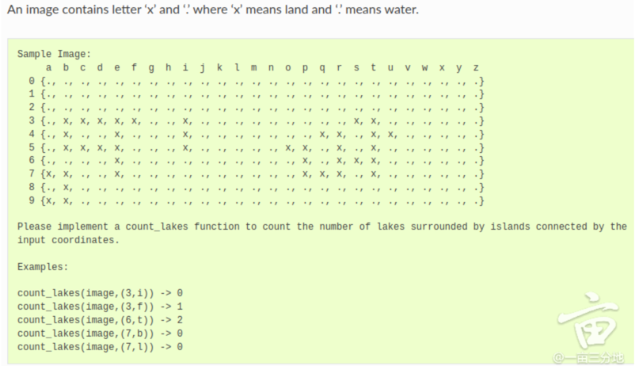

1. input: binary tree with InternalNode (with sum of length from children) and LeaveNode (contains string and length of string).
   一个String被分成了substring存在tree里面
   问：return第n个char.
   follow up: remove(idx, length) -> 从idx开始删除length个char (rope)
2. 利口疤溢疤变种 818 https://leetcode.com/problems/race-car/ （研究 0 < nxt[0] && nxt[0] < (target * 2)）
3. BQ
4. 给一个directed graph和target，find shortest cycle contains target。 第一问return length, 用的BFS解，
第二问要求return cycle path，用的DFS with depth，但是因为有overlapped cycle所以不能用visited，最后runtime‍是m^D, m是edge count, D是depth。
https://www.1point3acres.com/bbs/thread-909550-1-1.html
---
潵鸠糤 Validation https://leetcode.com/problems/utf-8-validation/
栮弃灞 https://leetcode.com/problems/first-bad-version/
---
1.context不是直接给的interval，但是实际是类似的
   [[0, 3], [1, 4], [5, 6]]
   1.1给一些interval，问在某个点有多少interval，比如上面，在2的时候就是2个，对于边界面试官这时候还不在意。
   1.2问如果最多只能有k个interval overlapping，让判断给的intervals满足否返回True or False，然后这时候如果在边界就不算
   [[1,2],[2,3]] 这时候2就是没有overlapping
2. 力口 爸咦把 https://leetcode.com/problems/race-car/
   这轮一开始是比那个题简单的类似context的，然后写完被烙印揪了几个corner case改了改
   然后正式做完，楼主用的DFS的方法写的，就是类似于top down + memorization结果被要求simulate，花了好半天递归绕的头痛（因为他不仅要长度还要序列）
   最后simulate出了正确的结果，不过时间也到了，所以不知道面试官满意了没，感觉可能还有小bug orz
3. 简单2题
   这轮白人小哥很chill
   3.1 类似merge 两个list，context和操作略复杂一点，实际就是merge 两个list
   然后follow up是k个list，就扯了扯heap or divide and conquer，分布式，然后好像很满意就没有让我写了
   3.2 AAAABBBDDDCCCC 一个string，所有相同的字符都在一起的  
   然后求最多的一个，先写了个O(N)然后 space complexity O(1)的
   然后问怎么优化，就说binary search，（从A开始 binary search 最后一个 然后B。。。）
---
2162. Minimum Cost to Set Cooking Time https://leetcode.com/problems/minimum-cost-to-set-cooking-time/
        2162变种，为了提高按钮灵活性允许按+-10%的时间。
---
第一轮： two D array，有障碍找最短路径，类似于这个幺儿久散(1293)。https://leetcode.com/problems/shortest-path-in-a-grid-with-obstacles-elimination/
   follow up是可以重复来回走，没时间做了，说了下DFS的思路，也没特别说通，这轮的结果介于weak hire和fail之间吧。
第二轮：高频题 而另久刘 2096 变种。https://leetcode.com/problems/step-by-step-directions-from-a-binary-tree-node-to-another/
   follow up是node是sort的 BST，要用logn方法实现。知道是用binary search，但是由于时间不够，方法也没说通，这轮的结果介于weak hire和fail之间。
第三轮：一道常规的图论 BFS的题，这轮没follow up。应该是hire，不知道为啥不是strong hire。。
第四轮：System design，类似于design steam的上线，隐身系统。这轮感觉大的很不错，但貌似也不是strong hire。
---
1. 题目场景是有一个蛋糕，上面有一些长方形的奶油块。现在你要切这个蛋糕，每一刀或平行或竖直（无斜刀）。
   并且贯穿，从一端到另外一端，也就是每一刀必定把你切的那块蛋糕变成两块。不可以破坏奶油块。
   最终要求切出来的每块蛋糕上面都最多有一个奶油块，求问能否有切法满足要求，如果有valid的切法最少几刀。
   同狗家一贯的策略面试官并没有给出输入格式，应该只需要奶油块坐标，蛋糕大小无所谓。第一个小问题是举个切不出来的反例
   ```
   第一题有点像那个转头墙的变种…
   奶油块就是砖头，先看x轴有没有可能切下来不穿过其他砖头
   然后看Y指标
   当X跟Y都可以切下去并且没有横穿其他 则表明可以。
   补充内容 (2022-07-01 13:48 +08:00):
   或者更简单点理解为
   x轴有没有的interval 有没有overlap
   在看Y轴有没有
   ```
   https://www.1point3acres.com/bbs/thread-908058-1-1.html
2. 类似蠡口 污污斯 554 https://leetcode.com/problems/brick-wall/
---
1. coding -- check if the given 20 cards can be divided into 4 hands (Texas Holdem) which are either straight (not royal) flush or 4 of a kind. 
   Follow up to check if it will work by replacing only one card?
2. behavioral -- resume check? an unethical experience?
3. coding -- given a dictionary of file tree, find entire size of the given file or directory(sum of the files in it). 
   Follow up to implement a directory-delete function.
4. coding -- [3,4,2,5,1,6,7,9] to find longest sublist strictly increasing by one, e.g. [3,4,5,6,7]. 
   Follow up to find longest sublist strictly increasing e.g. [3,4,5,6,7,9].
https://www.1point3acres.com/bbs/thread-907862-1-1.html
---

https://www.1point3acres.com/bbs/thread-906295-1-1.html
---
1. 给你一个relationship list， 以及一个pattern, 以及starting person和ending person, 需要回答有没有可能output一个符合pattern的person的list
   例子：
   relationships: [0,1,'F'], [1,2,'E'],[2,3,'E'] (是bidirectional的)
   pattern: "FEE" (F是friend的意思，E是enemy的意思)
   starting person:0
   ending person:3
   expected output: true (因为[0, 1, 2, 3] 符合 "FEE")
   DFS search all path from `0` to `3` and check if there is a valid path equal `pattern`
2. https://leetcode.com/discuss/interview-question/1895536/google-phone-interview-time-to-wait-for-agent 
   https://leetcode.com/problems/process-tasks-using-servers/
3. https://leetcode.com/discuss/interview-question/1779091/google-phone-interview-usa-&#8205;&#8205;&#8204;&#8204;&#8204;&#8204;&#8205;&#8205;&#8204;&#8205;&#8204;&#8205;&#8205;&#8205;&#8204;&#8204;&#8204;&#8205;restaurant-wait-list
4. https://leetcode.com/discuss/interview-question/1431204/google-onsite-question-stacking-boxes
   https://www.1point3acres.com/bbs/thread-905964-1-1.html
---
lc 叁贰玖 329 改了一下说是下一个格子可以同行同列任意一个
dfs+dp 国人小哥 我时间复杂度答得不太好 https://leetcode.com/problems/longest-increasing-path-in-a-matrix/
---
1. coding
   given N number of nodes, what's the maximum amount of edges you can add and make sure of no cycles.
   如果是有向图?都答了， 面试官给了个hint
   第二个是判断两个图一样
2. coding
   有K 种不同的宝石， 每个无限多， 把这些宝石放在一个 M*N 的格板上， 要求不能有三个连续的格子是一样的宝石。
   写一个函数随机生成一种放置方式。- 代码写完， 跑了test 就没时间了
---
target L4。1. 蠡口 要领私把 1048 https://leetcode.com/problems/longest-string-chain/; 给interviewer解释了一会儿自己的解法并且他finally get到了，但是自己解法就是高频解法啊hh. 
follow up就是如何optimize，最后用bucket，时间复杂度O(n), follow up没要求implement
---
1. 题目与design file system那题类似 不过更简单 上来就把一个类file system的Map （key: entityId, value: entityObject）给你了。两种entity 一种directory 一种file 都有Id。directory会有children, file会有size。先问给定一个entity Id 怎么计算他的size （包括children的）。follow up: 给一个List of entity，return list of entity size。
follow up2: 给一个entity id 怎么absolute print entity path。
2. 第三轮 coding
   graph path compression。leetcode上无这题 不过有老外的面经。Input给一个list 里面有所有的start node，它跟它们的children组成了一个graph，compress 里面的path, 然后return compress之后的start node。 这个讲真一开始挺懵的，大姐一开始有点没说明白那些需要compress的path如何定义为相同的。给的例子是
   A -> B -> C -> END
   A ->        -> D -> END
   A -> H - END
   可以compress成
   A -> BC -> END
   A ->    -> D -> END
   A -> H - END
   如果你也看不懂这个example那就对了，我也问了好久 最后才搞明白 A能到B H，C能到END 或者 D。这里的end是个special node，用来indicate end of the path
   我一开始问她这里的B C在不同的path离是value一样的不同的node还是同样的Node但是不同path share它们的 她说是前者 让我迷糊了好一阵 可能我也没问好吧，后面才搞清楚BC都是node object reference，实际上是后者。
   dfs 解，当一个Node的child只有一个 而且它的child只有它一个parent的时候 可以compress。想清楚这一点就好解了，不过当我想到并且问清楚的时候时间已经不多了 最后应该没有做到Bug fre‍‍‌‌‌‌‍‍‌‍‌‍‍‍‌‌‌‍e。面试里第一次做这题感觉挺难的。希望中国大姐手下留情吧。
3. 第四轮 coding
   白人小哥，人很友善，上来先寒暄聊了5分钟。题目是高频car race
   显示给string of instruction，然后计算最后的距离
   follow up: hard难度的力扣题 input距离 return 最短的instruction string，这个解法网上很多就不多说了，我用的bfs
https://www.1point3acres.com/bbs/thread-904849-1-1.html
---
国人小哥，预定房间问题。给n个房间，index 0-n-1。给一个访客的二维数组：{{0,3}，{0,5}，{1，6}，{5,8}，{10,12}}，第一个人0时来，3时走，
优先住index小的房间，每人只能住一间，问访客都住完后，哪个房间住过的人最多，并返回人数。先对访客数组排序，
然后个boolean数组记录房间是否有人，再用个hashmap或数组存次数。
https://leetcode.com/discuss/interview-question/1566515/GoogleorOnsiteorBusiest-meeting-room/1143254
https://www.1point3acres.com/bbs/thread-904445-1-1.html
---
第一題設計一個wordle game  給定一個secret word 跟一個guess word
return color list
if the character and location is correct -> return green
if the character is correct and location is incorrect -> return yellow
else -> return red
ex: secret : WORDLE, guess: WOLDCA
return "GGYGRR"
follow up: duplicate characters in both secret word and guess word.

第二題 有點類似lc 耳遛玖變形 https://leetcode.com/problems/sequence-reconstruction/
https://leetcode.com/problems/sequence-reconstruction/discuss/1209706/Java-Clean-Topological-Sort
給許多長度為3的 code list and N
code list中的code是有按照順序排的
求能不能找出長度為N的唯一解
ex.
N = 5 codeList = ["abc", "bcd", "cde"] return "abcde"
N = 6 codeList = ["abc", "def"] return [] since it could be "abcdef" or "defabc"
第三題 設計翻譯器OOP

---
1. Coding：给一个很长的字符串，然后一个map，里面的key value分别是keyword和score，就是说给的string里面能找到0-n个keyword，问最多能得多少分。这是一个经典时尚动态规划。秒了。 面试官迟到了8分钟，搞得我心态有点不稳，所以后来检查发现不少bug，，，，
   follow up是说要我给出都有哪些keyword。 
2. Coding： 给一个二叉树，每个节点有个value，然后再给两个value，问从value1的那个节点怎么走到value2. 
   Follow up是这个树每个节点变得有规律，比如当前点是i，那左孩子变成i*2，右孩子i*2 + 1.
3. Coding： 有个movie class，每个object都有相似movie和评分，还有title。然后给你一个movie，给一个integer N，请你返回top rated movies similar to the given movie，其中间接相似movie也算的. 我有点大意了，就直接说这个用union find就行了，反正就是把movie放到里面，连在一起的就都是相似的，然后排序嘛。面试官很惊讶，但是表示这样确实也可以。‍‍‌‌‌‌‍‍‌‍‌‍‍‍‌‌‌‍。。。。然后开始写代码才发现其实这个问题简单得多。其实简单遍历一下就能得到所有相似movie，然后就是排序了。follow up是万一很多movie rating一样，你怎么返回？万一movie很多，一台机器放不下，你怎么办？
---
2. Coding, 霸凌三。设计数据结构，https://leetcode.com/problems/bricks-falling-when-hit/ 只有一次hit怎么处理，follow-up：大于一次怎么处理。如果设计成在线游戏，怎么低延迟，高可用
3. Design，设计一个能够auto complete的language model。怎么设计model，如果需要保护隐私，怎么设计data flow和training flow
4. Design，在内存1GB的机器处理6TB日志文件，设计一个API返回top K的日志
5. Coding，随机生成迷宫
---
2. https://leetcode.com/problems/the-number-of-weak-characters-in-the-game/ 给了一个list of 每个学生两次考试的成绩。 比如 [50, 60], [70, 80]. 然后你作为教授，可以给学生pass 或者fail。 要求尽可能pass学生。给的限制是，对于两个学生来说，如果其中一人的两门成绩都高于另一人，不能两个人都pass，不然成绩好的同学会complain.
3. 里扣的 729
4. 给一个带字母的转动锁， 有很多圈，每一圈都有n个字母。问你如何比较快的找出这个锁可以组成的单词。这个题其实是要你先用trie建一个字典，这样lookup单词的时候，只要发现不在trie‍里面，就可以直接跳过。
---
1. 建议练习：蠡口 伊芭芭尔 1882 普通难度但是挺容易绕进去。这轮逻辑不清晰，但是应该做对了。感觉除了priority queue也没啥特别好的解法。
2. 建议练习： 蠡口 尔尔凄凄 或者 儿灵久留。这轮秒了。碰到了很友善的同胞。在此给你磕个头。
3. 建议练习： 蠡口 巴陵散。这题没找到原题，但是思路和这个习题很像。写了查并集的解法并且优化了。感觉这轮代码逻辑清晰，讲的很详细，一直引领着面试官来follow我。